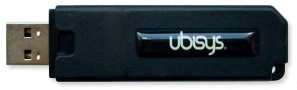

# Supported Capture Devices

This page lists supported / tested capture devices for the [`cap.js` tool](../README.md#zbtk-cap) and provides additional set-up instructions and hints.

## Ubisys IEEE 802.15.4 Wireshark USB Stick

| **Status** | ✅ Tested & Working |
| --- | --- |
| Operating Systems Tested | Windows, Linux (Debian) |
| Manufacturer | Ubisys |
| Homepage | https://www.ubisys.de/en/products/for-zigbee-product-developers/wireshark-usb-stick/ |
| Price | ~236,81€ |
| Pros / Cons | Pros: Easy to set-up and configure / no tinkering required. Cons: Quite expensive. |

Set-up according to [manufacturers instructions](https://www.ubisys.de/wp-content/uploads/ubisys-ieee802154-wireshark-manual.pdf). Only challenge was that when patching the `rndis_host.c` driver on Debian 12 "Bookworm", some `OID_*` constants in the driver have been renamed to `RNDIS_OID_*` instead, which had to be manually renamed in order for the new kernel package to compile.
