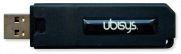
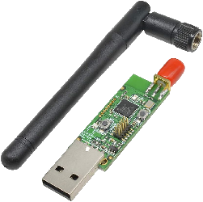
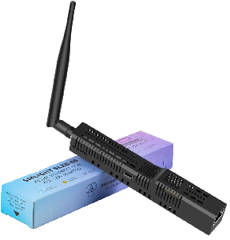

# Tested Capture Devices

This page lists supported and tested capture devices for the [`cap.js` tool](../README.md#zbtk-cap) and provides additional set-up instructions and hints.

Further devices, as for example listed for example in the [ZigBee2MQTT sniffing how-to](https://www.zigbee2mqtt.io/advanced/zigbee/04_sniff_zigbee_traffic.html), should be supported as well. Feel free to open a pull-request to add them to the list if you tested them successfully.

## Ubisys IEEE 802.15.4 Wireshark USB Stick



| **Status** | ✅ Tested & Working |
| --- | --- |
| Operating Systems Tested | Windows, Linux (Debian) |
| Manufacturer | Ubisys |
| Homepage | https://www.ubisys.de/en/products/for-zigbee-product-developers/wireshark-usb-stick/ |
| Price | ~236,81€ |
| Pros / Cons | Pros: Out of the box solution, registers as a network interface, easy to set-up and configure / no tinkering / no additional tools required. Cons: Quite expensive, requires kernel driver patching on Linux |

Set-up according to [manufacturers instructions](https://www.ubisys.de/wp-content/uploads/ubisys-ieee802154-wireshark-manual.pdf). Only challenge was that when patching the `rndis_host.c` driver on Debian 12 "Bookworm", some `OID_*` constants in the driver have been renamed to `RNDIS_OID_*` instead, which had to be manually renamed in order for the new kernel package to compile. To fix the issue I had to do the following replacements:

```batch
sed -i 's/OID_STR(OID_/OID_STR(RNDIS_OID_/g' rndis_host.c
```

As the stick registers as a network interface, it generates ZigBee Encapsulation Protocol (ZEP) packets in an UDP / IPv4 / Ethernet wrapper, thus run packet capture with:

```bash
# set the channel and pull the interface up
sudo ./ieee802154_options.sh -c 19
sudo ip link set dev enx001fee00295e up

# start capturing data
sudo tcpdump -n -i enx001fee00295e -s 0 -w - udp port 17754 | zbtk cap -u eth,ip4,udp,zep
```

<details>
  <summary><b>Full step-by-step set-up guide (Linux kernel patching, etc.)</b></summary>

This guide will follow you through the [manual provided by Ubisys](https://www.ubisys.de/wp-content/uploads/ubisys-ieee802154-wireshark-manual.pdf). First, grab yourself the Linux headers and kernel package required, in order to re-compile the needed network interface driver:

```bash
sudo apt-get update && sudo apt-get install -y linux-headers-$(uname –r) linux-libc-dev kernel-package
```

You can grab yourself a cup of coffee / tee, this will take some time to download and set-up.

After the installation is done, run `uname -r` to get the major / minor release of your Linux kernel, in my case `6.6.51+rpt-rpi-v7`, so 6.6. Proceed by downloading the Linux kernel sources:

```bash
sudo nano /etc/apt/sources.list
```

Uncomment the `deb-src` line at the end of the file, exit and save. Then proceed downloading the kernel sources for your release:

```bash
cd /usr/src
sudo apt-get update && sudo apt-get source linux-source-6.6
```

Download and extract the Ubisys IEEE 802.15.4 Wireshark USB stick driver package for Linux:

```bash
cd
wget http://www.ubisys.de/downloads/ubisys-m7b-rndis.tgz
tar -xzf ubisys-m7b-rndis.tgz
```

Copy the `rndis_host.c` file from the Linux kernel sources to the Ubisys driver folder, to patch it in the next step:

```bash
cd ubisys-m7b-rndis
cp /usr/src/linux-6*/drivers/net/usb/rndis_host.c .
```

Now patch the kernel module (note that is okay that some hunks cannot be applied), then `make` and `sudo make install` to apply the patch:

```bash
patch rndis_host.c rndis_host.c.patch
make
sudo make install
```

In my case (as tested February 17th 2025), patching the Debian 12 Bookworm sources on Kernel version `6.6.51+rpt-rpi-v7`, resulted in a compilation error on the `make` command. This is due to some renamed constants in the patch / driver. I had to patch the patch with:

```batch
sed -i 's/OID_STR(OID_/OID_STR(RNDIS_OID_/g' rndis_host.c
```

Afterwards repeat the `make` / `sudo make install`, which should now succeed. As a last step, as recommended by Ubisys, lets disable IPv6 for the interface:

```bash
echo "net.ipv6.conf.eth1.disable_ipv6 = 1" | sudo tee -a /etc/sysctl.conf
sudo sysctl -p
```

Validate that the `rndis_host` driver is currently not loaded. In case it is loaded, unload it before plugging in the USB capture stick to your Raspberry Pi:

```batch
lsmod
sudo rmmod rndis_wlan rndis_host
```

You are ready to plug-in your capture USB stick now. After plugging in the USB stick, use `dmesg` to check which interface the USB stick uses:

```batch
[547.998233] usb 1-1.4: new full-speed USB device number 4 using dwc_otg
[547.133729] usb 1-1.4: New USB device found, idVendor=19a6, idProduct=000a, bcdDevice= 1.05
...
[547.704199] rndis_host 1-1.4:1.0: RNDIS_MSG_QUERY(0x00010202) failed, -47
[547.707819] rndis_host ieee802154 channel is 11
[547.714346] rndis_host 1-1.4:1.0 eth1: register 'rndis_host' at usb-3f980000.usb-1.4, RNDIS device, 00:1f:ee:00:29:5e
[547.714591] usbcore: registered new interface driver rndis_host
[547.726540] usbcore: registered new interface driver rndis_wlan
```

As you can see in line `547.707819` the patch was applied successfully and ZigBee channel 11 was enabled, and in the following line `547.714346` you see that the interface name in my case was `eth1`. 
</details>

## Generic CC2531 Dongle w/ TI Sniffer Firmware 



| **Status** | ✅ Tested & Working |
| --- | --- |
| Operating Systems Tested | Linux (Debian) |
| Manufacturer | Generic / TI / Sonoff |
| Homepage | https://www.ti.com/product/en-us/CC2531 |
| Price | <10€ (!) |
| Pros / Cons | Pros: Very cheap, plenty of tool support. Cons: Requires FW flashing (+ flashing hardware / CC-Debugger or tinkering w/ Raspberry Pi), low throughput / weak hardware |

Flash the TI sniffing firmware according to the [instructions on Zigbee2MQTT](https://www.zigbee2mqtt.io/advanced/zigbee/04_sniff_zigbee_traffic.html#_1-flashing-the-cc2531-adapter). After flashing the stick will only work with `libusb`, so tools like `dumpcap` can access it. We recommend [`whsniff`](https://github.com/homewsn/whsniff) as it was specifically designed to generate a (P)CAP standard output stream from the TI CC2531 USB dongle w/ sniffer firmware:

```batch
sudo apt-get install libusb-1.0-0-dev
curl -L https://github.com/homewsn/whsniff/archive/v1.3.tar.gz | tar zx
cd whsniff-1.3
make
sudo make install
```

The stick outputs unwrapped WPAN packages, so no additional unwrapping of the frame will be required:

```bash
sudo whsniff -c 19 | zbtk cap
```

## SMLIGHT SLZB-06M Ethernet Dongle



| **Status** | ✅ Tested & Working |
| --- | --- |
| Operating Systems Tested | Linux (Debian) |
| Manufacturer | SMLIGHT |
| Homepage | https://smlight.tech/product/slzb-06m |
| Price | ~38,50€ |
| Pros / Cons | Pros: *No* additional set-up required! Works out of the box via Ethernet / PoE or serial. Strong hardware / large throughput. Cons: More expensive than other options |

The SMLIGHT SLZB-06M is a true out of the box solution! We would recommend signing in to the web interface once to (OTA) update the firmware and radio firmware. ZigBee Toolkit should work with any EmberZNet and HUSBZB-1 adapters. [ZigBee2MQTT recommends](https://www.zigbee2mqtt.io/advanced/zigbee/04_sniff_zigbee_traffic.html#with-emberznet-and-husbzb-1-adapters) to use [`ember-zli` to sniff](https://github.com/Nerivec/ember-zli/wiki/Sniff), however Ember ZLI is not natively able to generate a (P)CAP stream to standard output (stdout), thus we recommend to use [`ember-sniff`](https://github.com/kristian/ember-sniff) as an alternative, providing a CLI similar to `whsniff` for CC2531 dongles:

```batch
npm install -g ember-sniff
```

Sniffing is as easy as connecting to the dongle via TCP. `ember-sniff` also outputs raw WPAN packets, thus no additional unwrapping of packets will be required:

```bash
ember-sniff -p tcp://192.168.1.152:6638 -c 19 | zbtk cap
```
